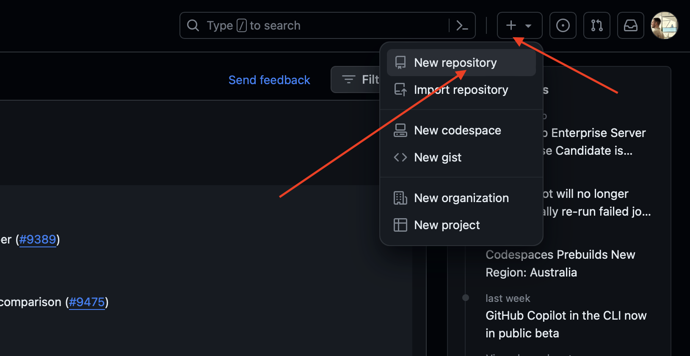
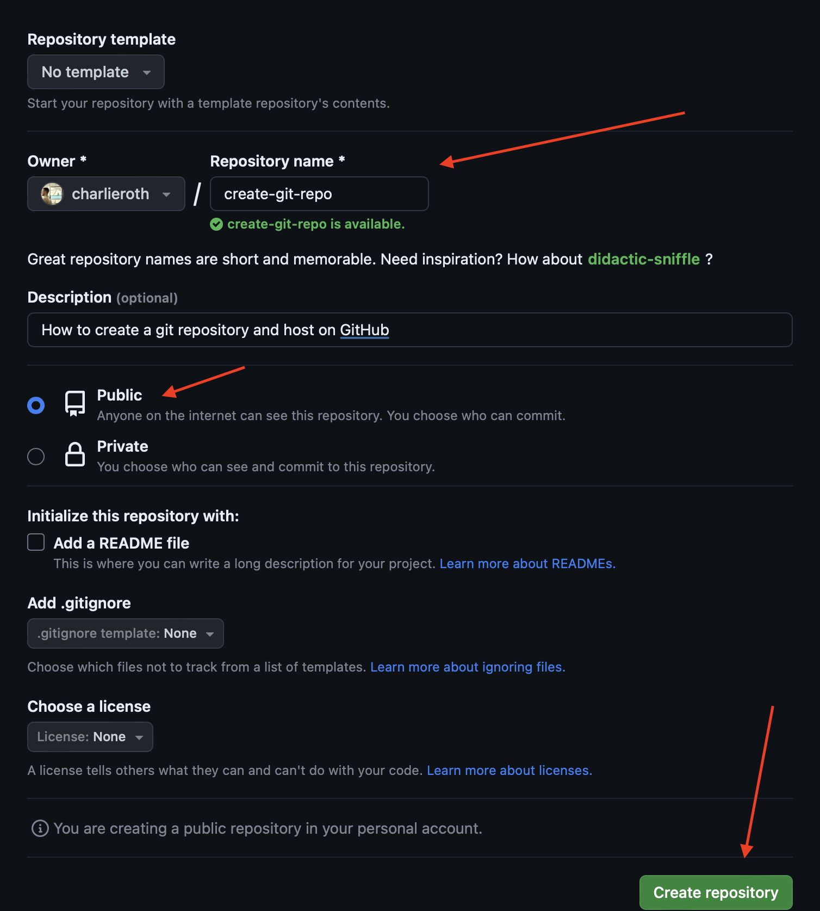
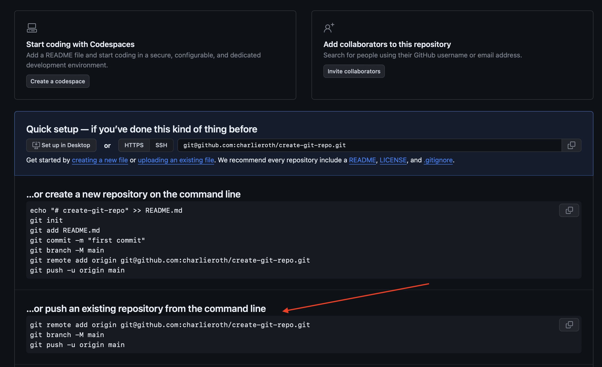
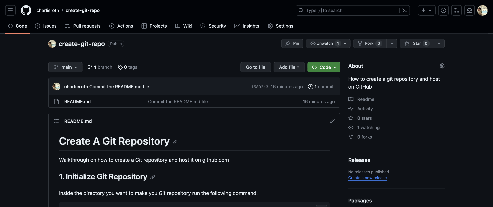

# Create A Git Repository

Walkthrough on how to create a Git repository and host
it on github.com

## 1. Initialize Git Repository

Inside the directory you want to make you Git repository
run the following command:

```bash
git init
```

Here is the what you should see in the terminal:

```bash
charlieroth/create-git-repo » git init
Initialized empty Git repository in /Users/charlie/github.com/charlieroth/create-git-repo/.git/

charlieroth/create-git-repo [main●] »
```

Now you have a Git repository!

## 2. Add Files To Git Repository

If you run the following command in the your directory:

```bash
git status
```

You should see something similar to the following output:

```bash
charlieroth/create-git-repo [main●] » git status
On branch main

No commits yet

Untracked files:
  (use "git add <file>..." to include in what will be committed)
	README.md

nothing added to commit but untracked files present (use "git add" to track)
```

This means that you have "untracked" files that need to be committed.

To commit the untracked files, run the following command:

```bash
git add .
```

This will "track" all of the files in the directory.

To "track" a specfic file in the directory, run the following command:

```bash
git add myscript.py
```

Where `myscript.py` is the name of the file you want to "track".

All together you should see something similar to this in the terminal:

```bash
charlieroth/create-git-repo [main●] » git add .
charlieroth/create-git-repo [main●] » git status
On branch main

No commits yet

Changes to be committed:
  (use "git rm --cached <file>..." to unstage)
	new file:   README.md
```

As you can see the file `README.md` is track and read to be committed.

## 3. Commit Your Changes

To commit your changes, run the following command:

```bash
git commit -m "Your commit message"
```

In the terminal you should see something like this:

```bash
charlieroth/create-git-repo [main●] » git commit -m "Commit the README.md file"
[main (root-commit) 00a7b17] Commit the README.md file
 1 file changed, 0 insertions(+), 0 deletions(-)
 create mode 100644 README.md
```

You can see that the commit was added to your git repository by running the `git log` command:


```bash
charlieroth/create-git-repo [main●] » git log

commit 00a7b17e34c3a393abbd2dc70012ceea6254e844 (HEAD -> main)
Author: Charlie Roth <charlieroth4@icloud.com>
Date:   2 minutes ago

    Commit the README.md file
```

To exit the "log view", press `q`

Running the `git status` command one more time:

```bash
charlieroth/create-git-repo [main] » git status
On branch main
nothing to commit, working tree clean
```

We can see that we have a "clean working tree". This means that you have no pending changes that can be committed

## 4. Create Repository on Github

In order to store the code on Github you will need to go to https://github.com/

In the top right corner you will click on the `+` button



## 5. Fill In Github Repository Details

Next you will need to give your Github repository a name and an optional description.

For now make the repository "Public" so it can be easily accessible



Click the `Create repository` button.

## 6. Connect and Push Local Repository

The repository on your machine is what we will call your "local repository". The repository you just created on Github is your "remote repository".

To push your local repository to your remote repository run the commands in the `…or push an existing repository from the command line` section __one at a time__



Running the commands, you should see similar output to the following:

```bash
charlieroth/create-git-repo [main●] » git remote add origin git@github.com:charlieroth/create-git-repo.git
charlieroth/create-git-repo [main●] » git branch -M main
charlieroth/create-git-repo [main●] » git push -u origin main
Enumerating objects: 3, done.
Counting objects: 100% (3/3), done.
Delta compression using up to 12 threads
Compressing objects: 100% (2/2), done.
Writing objects: 100% (3/3), 1.45 KiB | 1.45 MiB/s, done.
Total 3 (delta 0), reused 0 (delta 0), pack-reused 0
To github.com:charlieroth/create-git-repo.git
 * [new branch]      main -> main
branch 'main' set up to track 'origin/main'.
```

After this you can return to the browser and refresh the page and you should see your Github remote repository set up

